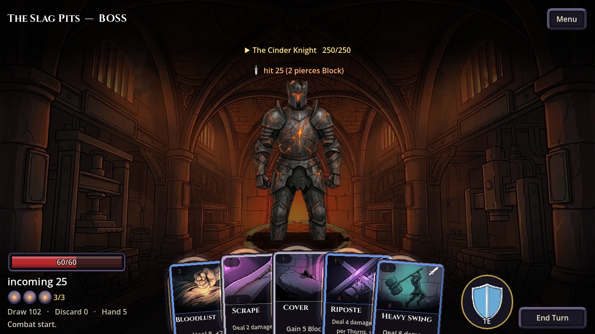
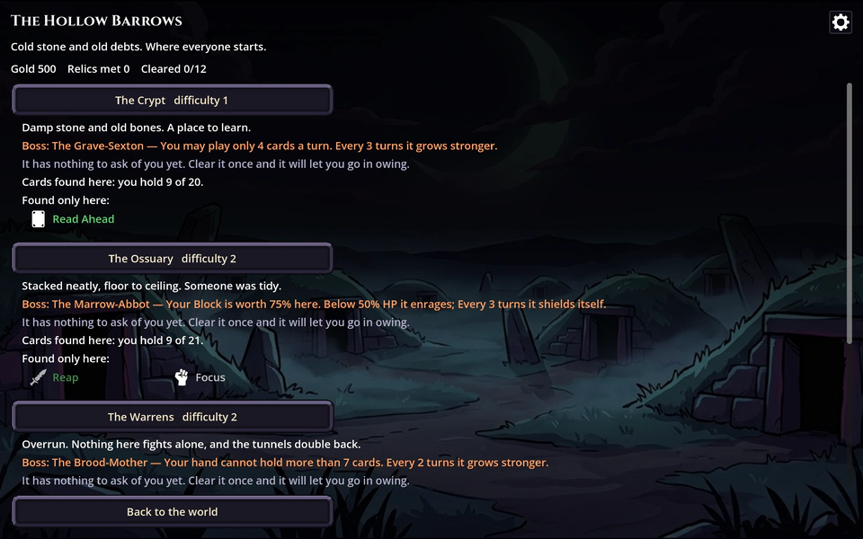
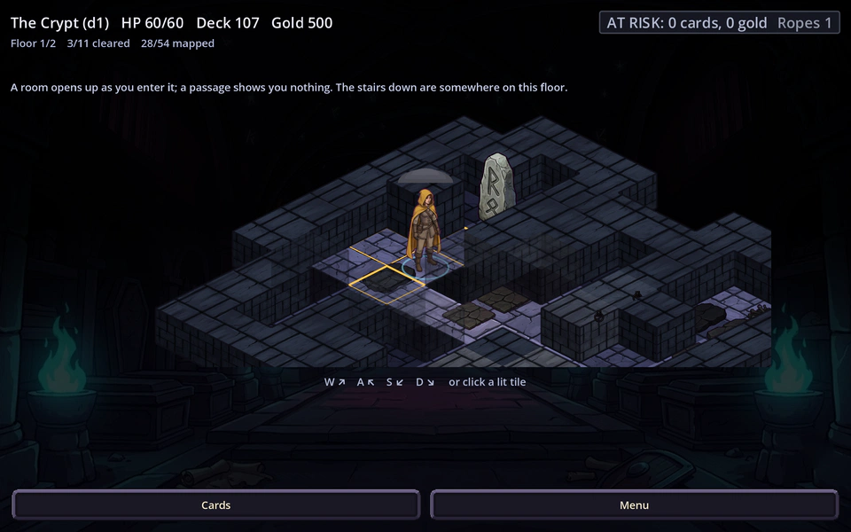
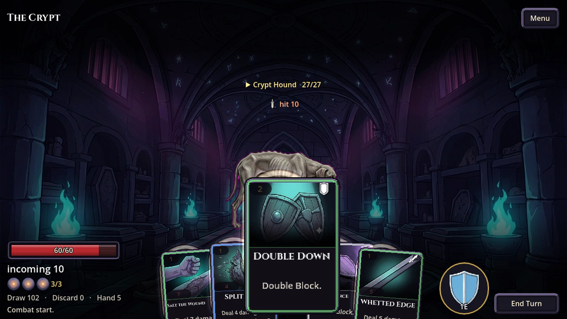
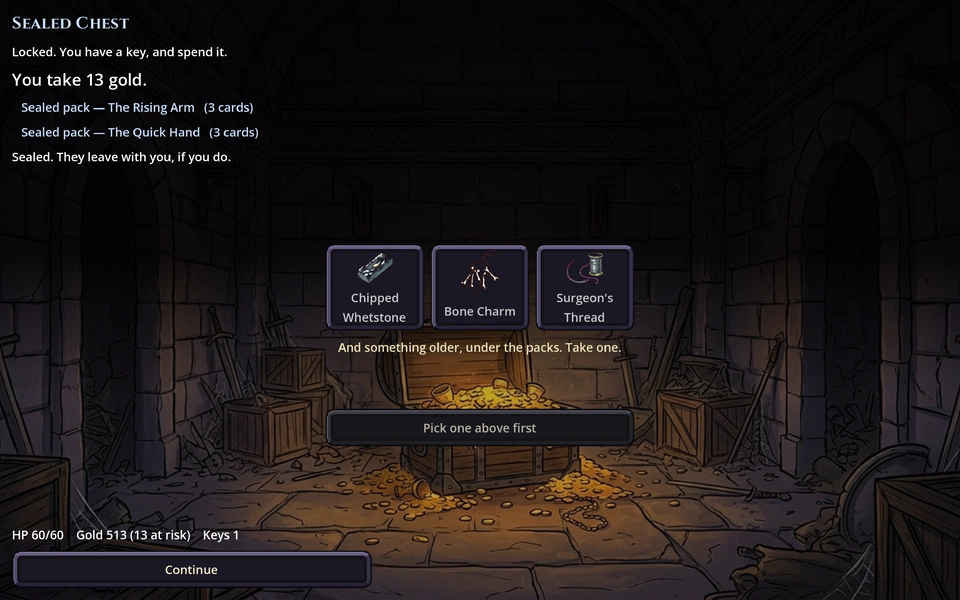
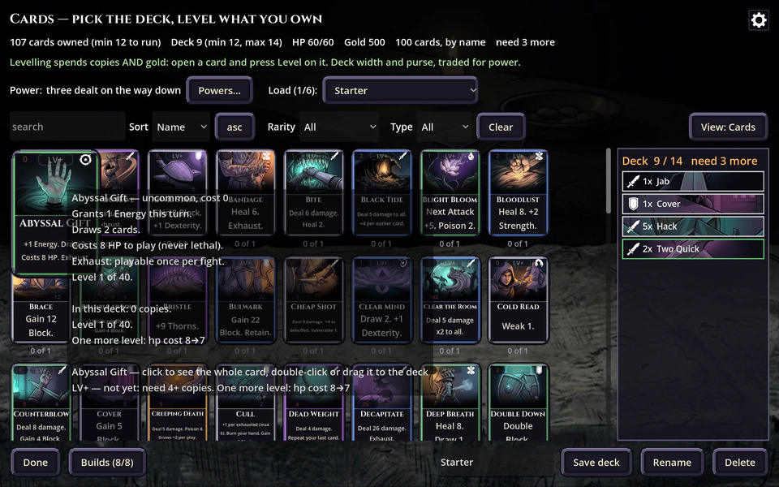
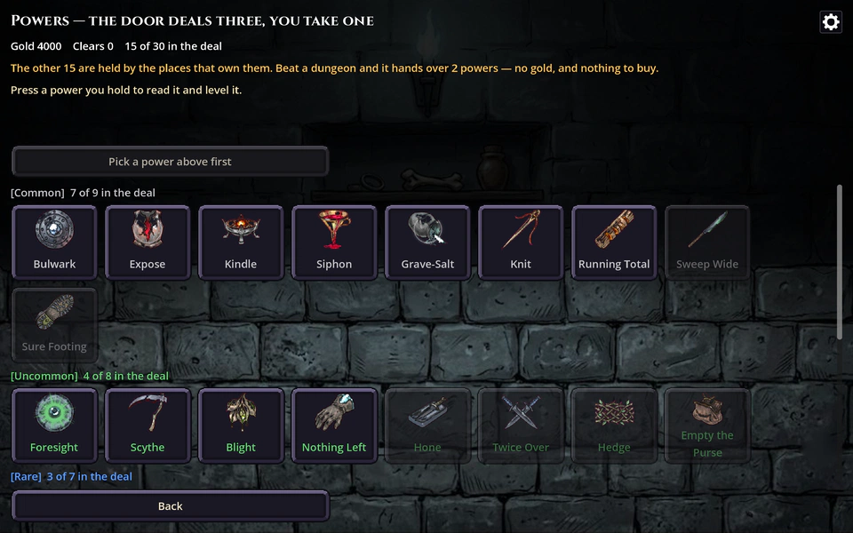

# The Owing

[](https://github.com/g-gemignani/the-owing/actions/workflows/ci.yml)
[](#tests)
[](https://github.com/g-gemignani/the-owing/releases/tag/latest)
[](#play-it)
[](https://godotengine.org)
[](LICENSE)

A deckbuilding roguelike with a persistent RPG meta layer, built in Godot 4.7
(GDScript). Slay-the-Spire-shaped combat — but what you carry between runs is a
*collection* you grow, fuse and spend, and a run you lose costs you most of it.



<sub>**The Cinder Knight**, the named finale of the Slag Pits — and you were told his
name, and what he does, on the screen where you picked the dungeon.</sub>

## Play it

No build step. Every green push to `main` publishes a fresh binary for every
platform that builds, under [one permanent link](https://github.com/g-gemignani/the-owing/releases/tag/latest) —
so these are always the newest commit, not the last time somebody remembered to cut a
release.

| | download | first run |
|---|---|---|
| **Linux** | [`TheOwing-linux-x86_64.zip`](https://github.com/g-gemignani/the-owing/releases/download/latest/TheOwing-linux-x86_64.zip) (65 MB) | `chmod +x TheOwing.x86_64 && ./TheOwing.x86_64` |
| **Windows** | [`TheOwing-windows-x86_64.zip`](https://github.com/g-gemignani/the-owing/releases/download/latest/TheOwing-windows-x86_64.zip) (74 MB) | SmartScreen warns once → *More info* → *Run anyway* |
| **macOS** | [`TheOwing-macos-universal.zip`](https://github.com/g-gemignani/the-owing/releases/download/latest/TheOwing-macos-universal.zip) (95 MB) | `xattr -dr com.apple.quarantine "The Owing.app"`, then open it |
| **Android** | [`TheOwing-android.apk`](https://github.com/g-gemignani/the-owing/releases/download/latest/TheOwing-android.apk) | `adb install`, or copy it over and allow unknown sources. **If it says "App not installed", uninstall the old copy first** — see below |
| **iOS** | *not in the release yet* | the build exists and is currently red — see below |

**There is no downloads badge, and there cannot be one.** GitHub counts downloads per
release *object*, and this channel deletes and recreates its release on every green push — so
the counter starts at zero several times a day and the number a badge would show is "downloads
since the last commit", which is not a number anybody wants. Measured rather than assumed: the
release object was three hours old and read 0 across all four assets, after real downloads
(D158).

**"App not installed" when you already have it.** Android identifies an app by the key that
signed it, not by its version, so a build signed with a different key is a different app
claiming the same name and the installer refuses it — without ever mentioning signatures. If
this repository has no `ANDROID_KEYSTORE_BASE64` secret, CI generates a throwaway key per
build and that refusal is guaranteed: uninstall the old copy, then install the new one. With
the secret set (`tools/make_release_key.sh` makes the key and prints the three secrets to
create), every build installs over the last one, and each release's notes say which of the two
it was (D157).

The links never change and always serve the newest build: the `latest` release is deleted and
recreated on every green push to `main`, so the URL is permanent and the file behind it is
whatever `main` is now. That is deliberate, and it is also why **every build tells you which
one it is** — the title screen carries `v0.1.0+<date>.<commit>` in the corner and Settings
spells it out under *Build*. Quote that string in a bug report; the filenames cannot.

Nothing here is code-signed by a paid identity and nothing here will be. The Android key
above only decides whether two builds count as the same app — it does not make either one
trusted — and **the .ipa will not install as-is**, because iOS runs signed code only. On
**NixOS** the Linux binary needs `steam-run`, or a `patchelf --set-interpreter`; see
[BUILD.md](BUILD.md).

**iOS is wired up and not yet working.** `build-ios` runs on every push, is allowed to
fail so it cannot hold up the other four, and is failing at `xcodebuild` today — so the
release carries four platforms, not five, and says so on its own page. When it goes
green the asset appears here with no further change. It will be **unsigned** when it
does: iOS runs signed code only, so it is for re-signing with Sideloadly, AltStore or
your own Xcode account.

The Android build is **untested on real hardware** — nobody has run this on a phone
yet, and text size at phone DPI is the most likely thing to be wrong (D65).

> **Status: playable prototype, fully painted.** All 310 art files are in — 27
> backdrops, 35 enemy plates, an illustration for every one of the 100 cards, and a
> frame kit that is *computed* rather than drawn. 39 test suites, including one that
> walks every screen and every dungeon asserting the player always has something to
> press. The systems are the point; the pictures now stop them looking unfinished.

---

## The loop

**1. Pick a fight you can see the shape of.** Difficulty is a choice, made up front —
every dungeon names its boss and its exclusive cards *before* you commit, so going
deeper is a decision and never a surprise.

**2. Crawl it.** One traversal model: a painted isometric building of rooms and
corridors over several floors, explored a tile at a time. A chamber is revealed whole
the moment you step into it; a corridor gives you two tiles and no more. Things walk
the floor and take a step whenever you do — and a fight is loud, so *where* you choose
to have one matters.

| | |
|---|---|
|  |  |
| **The boss is named before you commit.** | **A floor is a building, not a field.** |

**3. Fight.** Telegraphed intents, and many of the 35 archetypes *react* to what you
did last turn rather than rolling from a table. Every card carries its own
illustration and the level band it has earned.

**4. Bank it, or lose it.** Everything found in a run sits in escrow. Beat the boss and
it is yours permanently; die and you forfeit most of it. Between runs you fuse
duplicates into levels, buy and level Powers and Relics, and unlock deeper zones.

| | |
|---|---|
|  |  |
| **Cards are inspected in place, mid-turn.** | **What you walk to is a chest, with its own lock.** |
|  |  |
| **The collection is the progression.** | **One Power equipped per run, fired every turn.** |

<sub>Captures are generated, not curated: `tools/screenshots.gd` boots all 25 screens at
the shipped 1280x720 and `tools/readme_shots.gd` picks and downsamples the seven above.
Both are re-run when anything visual lands, so these cannot quietly go stale.</sub>

## What's in it

|                |                                                                |
|----------------|----------------------------------------------------------------|
| Cards          | 100, five rarities, levelled by fusing duplicates              |
| Enemies        | 35 archetypes with telegraphed intents; many react to you      |
| Bosses         | 12 — one per dungeon, named and announced before you commit    |
| Relics         | 30                                                             |
| Powers         | 10 — one equipped per run, fires once every turn               |
| Events         | 20                                                             |
| Dungeons       | 12 across 5 zones, difficulty 1 to 8                           |
| Traversal      | one model: an isometric crawl, walked by all 12 dungeons       |
| Art            | 310 files, the list closed — see [ART.md](ART.md)              |
| Tests          | 39 suites, including a playability integration test            |

Every piece of that is a `.tres` file plus one catalogue line. Adding more is a data
task, not a code task — see [CONTRIBUTING.md](CONTRIBUTING.md).

## Running it from source

If you only want to *play* it, take a binary from [Play it](#play-it) above — this
section is for working on it.

Needs **Godot 4.7**. Either put it on `PATH`, or:

```bash
GODOT=/path/to/godot ./run.sh
```

There is a Nix flake if you want a pinned toolchain — Godot, plus a JDK because `keytool`
signs the Android key:

```bash
nix develop --command godot
```

See [BUILD.md](BUILD.md) for building distributables and running them on each platform.

## Tests

```bash
tests/run.sh              # everything, in parallel
tests/run.sh softlock     # filter by name
GODOT=/path/to/godot tests/run.sh
```

Two kinds live in `tests/`:

* `test_*.gd` — headless script tests (`godot --script`).
* `*Test.tscn` — **scene** tests. Some properties only exist once a tree has actually
  been built (`mouse_filter`, wrapped line counts, scaled rects), and autoloads are not
  registered in a `--script` run.

`tests/test_compile.gd` checks that every script and scene root compiles, and
`tests/PlayableTest.tscn` walks every screen and every dungeon asserting the player
always has something to press. Both exist because a black screen once shipped and
survived five green runs: `--import` does not compile scripts, and `load()` returns a
non-null Resource for a script that failed to parse.

**There is no coverage badge, and that is deliberate.** GDScript has no line-coverage
instrumentation — no `gcov`, no `coverage.py`, nothing the engine exposes — so any
percentage on this page would be a number somebody typed. Everything in the badge row
above is either read live from GitHub or asserted by a test: the `39 suites` count is
checked against the globs `tests/run.sh` actually runs, by `tests/test_content.gd`, so
adding a suite fails the build until the badge is corrected.

Tests are sandboxed away from real save data, and the runner fails if any test leaves a
file behind. That is not paranoia: a test once overwrote a real `settings.json`, and a
debug harness destroyed someone's in-progress run.

## How the code is organised

```
scripts/     game code — one file per screen or system
resources/   all content as .tres data: cards, enemies, relics, powers, events,
             dungeons, zones, builds
scenes/      thin .tscn wrappers; screens build their UI in code
assets/      art and audio; see the licence note at the bottom
tests/       39 suites + tests/run.sh
tools/       diagnostics and generators, not shipped
docs/        the README's screenshots; nothing in the game loads them
DESIGN.md    the reasoning behind every decision, and every mistake
```

Three ideas run through all of it.

**`scripts/balance.gd` is the single source of truth for tuning.** Every constant and
formula lives there so the game and the headless simulator cannot drift apart. A
duplicated lookup table elsewhere once went stale and made the first dungeon literally
unplayable; the tests now reject private copies of shared tables.

**Tuning is measured, not guessed.** `tools/sim_balance.gd` auto-plays fights and
reports run completion per build per dungeon:

```bash
godot --headless --script tools/sim_balance.gd
```

Several designs that read fine on paper were reverted after the numbers came back.
Enemies that punish blocking dropped defensive builds from 74% to 32% completion before
being retuned. Fusion was measured making the player too strong too fast. Enemy scaling
once made a *maxed* deck perform worse than a merely good one.

**Anything with an output is generated from the thing it describes.** The art shopping
list (`tools/art_manifest.gd` → [ART_ASSETS.md](ART_ASSETS.md)), the UI frame kit
(`tools/gen_ui_kit.gd`), the six combat effects, and the screenshots above are all
produced by a script rather than maintained by hand — because a document that can
disagree with the code eventually will.

## Design notes

[DESIGN.md](DESIGN.md) is long, and it is the actual documentation: decisions **D1
through D140**, each with what was tried, what was measured, and what broke. If you only
read three:

* **D36, the difficulty ratchet** and **D38, enemies that react** — two cases where the
  obvious design was wrong and the simulator said so.
* **D88 and D94** — three traversal models lost a measured bake-off to a fourth, and
  were deleted once nothing could reach them.
* **D140** — a resumed dungeon rendered as an empty void for a day, because
  `JSON.stringify` does not fail on a type it cannot write; it writes `str()` of it.

## Licence

Code is [Apache 2.0](LICENSE).

Everything under `assets/art/` — the title illustration, the 27 backdrops, the 35 enemy
plates, the 100 card illustrations and the generated frame kit — is generated for this
project and is **not** CC0; see `assets/art/README.md`. So are the five looping music
tracks in `assets/audio/music/`; see their `PROVENANCE.txt`.

The two typefaces are the exception: they were downloaded, and both are under the **SIL
Open Font License 1.1** — [Cinzel](https://github.com/NDISCOVER/Cinzel) by Natanael Gama
for headings and card names, and [Fira Sans](https://github.com/mozilla/Fira) by Carrois
Corporate & Edenspiekermann for everything else. Each ships its upstream `OFL.txt` in
`assets/art/fonts/`, with the versions and hashes in that directory's `PROVENANCE.txt`.

What is left in `assets/pixel/` is **CC0** by [Kenney](https://kenney.nl) — 1-Bit Pack
(the card sheet) and Pattern Pack Pixel (the five zone tiles). Each pack's original
licence file ships in the directory holding its assets. Kenney's work is public domain and
requires no attribution; it is given here because it is deserved.

Four packs that used to be here are gone rather than unattributed: Tiny Dungeon supplied
the enemy sprites until generated plates replaced them (D89), UI Pack RPG Expansion
supplied the frames until `tools/gen_ui_kit.gd` computed them (D83), and Interface Sounds,
RPG Audio and Music Jingles supplied the sound effects until `tools/gen_sfx.py` replaced
all 23 with one synthesised set (D150) — three packs at three sample rates over a
generated score is what made the game sound like three games.

All the audio is now ours: `tools/gen_music.py` for the five loops and `tools/gen_sfx.py`
for the 23 effects, with provenance and measurements beside the files in `assets/audio/`.
